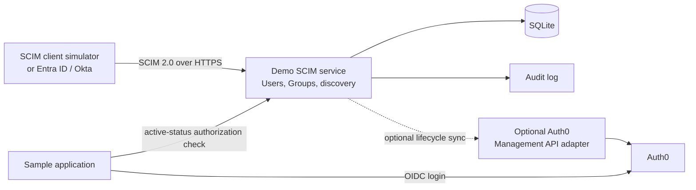

# SCIM Lifecycle Lab

A small, inspectable demo of SCIM 2.0 identity lifecycle provisioning alongside an Auth0-protected application.

The lab is designed to make one distinction concrete:

- SCIM provisions users and groups and manages their lifecycle.
- Auth0 authenticates people into the sample application through OIDC.
- An enterprise directory, such as Microsoft Entra ID or Okta, is the usual SCIM client.
- This project is the SCIM service provider.

Auth0 is intentionally not assumed to be a generic outbound SCIM client. Any tenant-specific provisioning features should be verified independently before relying on them.

## Learning Scenario

The walkthrough follows two employees, Alice and Bob:

1. Provision users through SCIM.
2. Create an `Engineering` group and manage its membership.
3. Change Alice's department and other profile attributes.
4. Disable Alice with `active: false`.
5. Demonstrate that the sample application denies disabled users.
6. Re-enable Alice, restore membership, and repeat the change from a real test IdP when available.

## Architecture



The sample application must enforce lifecycle status after authentication. An existing Auth0 browser session can otherwise outlive a later SCIM `active: false` update.

## Scope

The SCIM service will expose these SCIM 2.0 endpoints:

| Endpoint | Purpose |
| --- | --- |
| `GET /ServiceProviderConfig` | Advertise implemented capabilities |
| `GET /ResourceTypes` | Describe User and Group resource types |
| `GET /Schemas` | Publish supported schemas |
| `GET/POST /Users` | Search or create users |
| `GET/PUT/PATCH/DELETE /Users/{id}` | Manage an individual user |
| `GET/POST /Groups` | Search or create groups |
| `GET/PUT/PATCH/DELETE /Groups/{id}` | Manage an individual group |

The first implementation will support bearer-token authentication, pagination (`startIndex`, `count`), a limited documented filter grammar, and SCIM-compliant `ListResponse` and error objects. It will only advertise features that actually work.

## Auth0 Boundary

Auth0 is part of the login flow, not the core SCIM protocol demonstration.

- The sample application uses an Auth0 OIDC application for sign-in.
- The application checks the local SCIM user is active before serving protected content.
- An optional adapter can use the Auth0 Management API to block a corresponding Auth0 user when SCIM sets `active: false`.
- The adapter stores the SCIM `externalId` in Auth0 `app_metadata` and may map department and employee number to metadata.
- SCIM groups and Auth0 roles remain distinct until an explicit, documented mapping is added.
- Password synchronization is out of scope.

## Repository Layout

```text
apps/
  scim-service/        SCIM API, persistence, and audit logging
  demo-app/            Auth0-protected application and lifecycle gate
packages/
  scim-contract/       Shared SCIM schemas, types, and error helpers
  client-simulator/    Repeatable lifecycle requests
docs/
  implementation-plan.md
  auth0-setup.md
  idp-setup.md
```

The layout is a target structure; the repository currently contains planning documentation only.

## Demo Flow

1. Run the SCIM service and sample application locally.
2. Use the client simulator to create Alice and Bob.
3. Create `Engineering` and add Alice.
4. Sign in to the sample application through Auth0.
5. Patch Alice's department through SCIM and inspect the audit trail.
6. Patch Alice with `active: false` and verify the application denies access.
7. Re-enable Alice, restore membership, and verify access again.
8. Optionally replace the simulator with an Entra ID or Okta test tenant.

## Quality Bar

- Duplicate `userName` requests return `409` with `scimType: "uniqueness"`.
- Missing resources return `404`; unauthenticated requests return `401`.
- `PATCH` changes are atomic.
- Repeating a group-membership change is harmless.
- Filtering and pagination return valid `ListResponse` payloads.
- Deleted users no longer appear in list results.
- Discovery documents match the actual implementation.
- Every lifecycle mutation creates an auditable, redacted event with before-and-after state.

## Documentation

The phased build plan, implementation choices, and test matrix are in [docs/implementation-plan.md](docs/implementation-plan.md).

## References

- [RFC 7643: SCIM Core Schema](https://www.rfc-editor.org/rfc/rfc7643)
- [RFC 7644: SCIM Protocol](https://www.rfc-editor.org/rfc/rfc7644)
- [Auth0 enterprise identity providers](https://auth0.com/docs/authenticate/identity-providers/enterprise-identity-providers)
