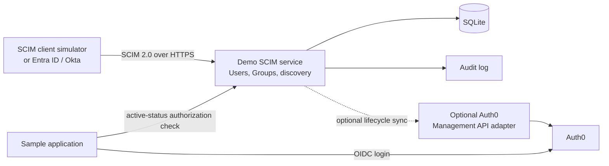

# SCIM Lifecycle Lab

A small, inspectable demo of SCIM 2.0 identity lifecycle provisioning alongside an Auth0-protected application.

The lab is designed to make one distinction concrete:

- SCIM provisions users and groups and manages their lifecycle.
- Auth0 authenticates people into the sample application through OIDC.
- An enterprise directory, such as Microsoft Entra ID or Okta, is the usual SCIM client.
- This project is the SCIM service provider.

Auth0 is intentionally not assumed to be a generic outbound SCIM client. Any tenant-specific provisioning features should be verified independently before relying on them.

## Learning Scenario

The walkthrough follows two employees, Alice and Bob:

1. Provision users through SCIM.
2. Create an `Engineering` group and manage its membership.
3. Change Alice's department and other profile attributes.
4. Disable Alice with `active: false`.
5. Demonstrate that the sample application denies disabled users.
6. Re-enable Alice, restore membership, and repeat the change from a real test IdP when available.

## Architecture



The sample application must enforce lifecycle status after authentication. An existing Auth0 browser session can otherwise outlive a later SCIM `active: false` update.

## Scope

The SCIM service will expose these SCIM 2.0 endpoints:

| Endpoint | Purpose |
| --- | --- |
| `GET /ServiceProviderConfig` | Advertise implemented capabilities |
| `GET /ResourceTypes` | Describe User and Group resource types |
| `GET /Schemas` | Publish supported schemas |
| `GET/POST /Users` | Search or create users |
| `GET/PUT/PATCH/DELETE /Users/{id}` | Manage an individual user |
| `GET/POST /Groups` | Search or create groups |
| `GET/PUT/PATCH/DELETE /Groups/{id}` | Manage an individual group |

The first implementation will support bearer-token authentication, pagination (`startIndex`, `count`), a limited documented filter grammar, and SCIM-compliant `ListResponse` and error objects. It will only advertise features that actually work.

## Auth0 Boundary

Auth0 is part of the login flow, not the core SCIM protocol demonstration.

- The sample application uses an Auth0 OIDC application for sign-in.
- The application checks the local SCIM user is active before serving protected content.
- An optional adapter can use the Auth0 Management API to block a corresponding Auth0 user when SCIM sets `active: false`.
- The adapter stores the SCIM `externalId` in Auth0 `app_metadata` and may map department and employee number to metadata.
- SCIM groups and Auth0 roles remain distinct until an explicit, documented mapping is added.
- Password synchronization is out of scope.

## Repository Layout

```text
apps/
  scim-service/        SCIM API, persistence, and audit logging
  demo-app/            Auth0-protected application and lifecycle gate
packages/
  scim-contract/       Shared SCIM schemas, types, and error helpers
  client-simulator/    Repeatable lifecycle requests
docs/
  implementation-plan.md
  auth0-setup.md
```

## Current Implementation

The first local SCIM slice is implemented:

- SQLite migrations for users, groups, group membership, and audit events.
- Bearer-protected discovery endpoints and SCIM-formatted errors.
- User and Group create, read, replace, patch, delete, pagination, and documented equality filters.
- Atomic mutations, case-insensitive unique `userName` and `displayName`, and cascading group-membership removal when a User is deleted.
- Request/outcome auditing with configurable payload redaction and a bearer-protected development inspection endpoint.
- A repeatable HTTP client simulator for the Alice/Bob lifecycle scenario.
- A server-side Auth0 Regular Web Application that checks an Auth0 `sub` against the matching active SCIM `externalId` on every protected request.

The optional Auth0 Management API adapter remains intentionally pending.

## Run Locally

Prerequisites: Node.js 22.13 or later and npm 11 or later.

1. Copy `.env.example` to `.env`, then replace `SCIM_BEARER_TOKEN` with a local token of at least 16 characters.
2. Install dependencies with `npm install`.
3. Apply the SQLite schema with `npm run migrate`.
4. Start the service with `npm run dev:scim`.
5. Check `http://127.0.0.1:3000/health` and then run `npm run simulate:lifecycle` in a second terminal.
6. Inspect current resources and redacted audit events with an authenticated `GET /_dev/inspection` request.
7. Run `npm run simulate:cleanup` to remove the simulator's known resources.

To run the Auth0 demo application, configure the Auth0 values in `.env` and follow [docs/auth0-setup.md](docs/auth0-setup.md), then run `npm run dev:demo` and open `http://localhost:3001`.

The service accepts `application/scim+json` on SCIM mutation requests. `SCIM_ENABLE_INSPECTION` is disabled by default in code and should remain limited to local development or an authenticated administrative audience.

## Implemented Protocol Subset

| Area | Supported behavior |
| --- | --- |
| Authentication | Static bearer token on all SCIM endpoints; unauthenticated calls receive a SCIM `401` error before request-body processing. |
| Discovery | `ServiceProviderConfig`, `ResourceTypes`, and `Schemas`; only implemented capabilities are advertised. |
| User filters | `userName eq "value"` or exact `externalId eq "value"`, with `startIndex` and `count` pagination. |
| Group filters | `displayName eq "value"`, with `startIndex` and `count` pagination. |
| User PATCH | `add`, `replace`, and `remove` for explicit core and enterprise attribute paths. |
| Group PATCH | `add`, `replace`, and `remove` for `displayName` and `members`; repeated member adds are no-ops. |
| Enterprise attributes | Department and employee number through `urn:ietf:params:scim:schemas:extension:enterprise:2.0:User`. |
| User deletion | Permanent deletion; memberships are removed atomically and affected Group versions advance. |

Unsupported filter or PATCH paths return explicit SCIM errors. Bulk operations, sorting, ETags, and password synchronization are not supported.

## Demo Flow

1. Run the SCIM service and sample application locally.
2. Set `SCIM_AUTH0_SUBJECT` to the selected Auth0 user's `sub`, then run `npm run simulate:provision`.
3. Sign in to the sample application through Auth0 and verify active SCIM access.
4. Run `npm run simulate:disable`, then refresh the protected page to verify access is denied.
5. Run `npm run simulate:enable`, then refresh to verify access is restored.
6. Inspect the audit trail and run `npm run simulate:cleanup` when finished.
7. Optionally replace the simulator with an Entra ID or Okta test tenant.

The detailed current walkthrough is in [docs/demo-script.md](docs/demo-script.md).
The Auth0 tenant and stable identifier setup is in [docs/auth0-setup.md](docs/auth0-setup.md).

## Quality Bar

- Duplicate `userName` requests return `409` with `scimType: "uniqueness"`.
- Missing resources return `404`; unauthenticated requests return `401`.
- `PATCH` changes are atomic.
- Repeating a group-membership change is harmless.
- Filtering and pagination return valid `ListResponse` payloads.
- Deleted users no longer appear in list results.
- Discovery documents match the actual implementation.
- Every lifecycle mutation creates an auditable, redacted event with before-and-after state.

## Documentation

The phased build plan, implementation choices, and test matrix are in [docs/implementation-plan.md](docs/implementation-plan.md).

## References

- [RFC 7643: SCIM Core Schema](https://www.rfc-editor.org/rfc/rfc7643)
- [RFC 7644: SCIM Protocol](https://www.rfc-editor.org/rfc/rfc7644)
- [Auth0 enterprise identity providers](https://auth0.com/docs/authenticate/identity-providers/enterprise-identity-providers)
